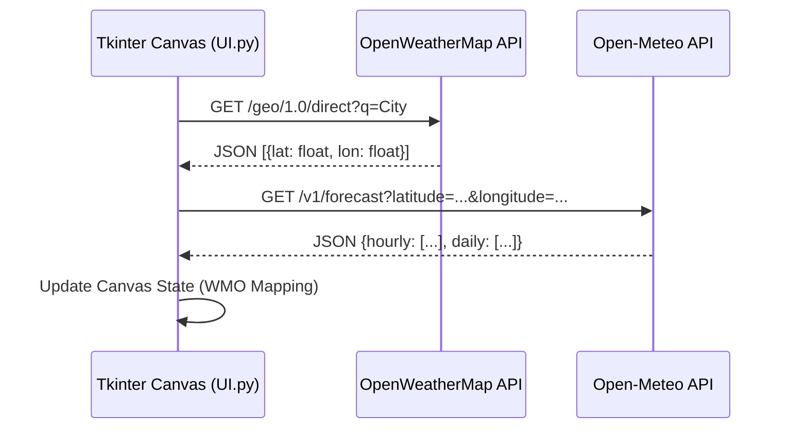

# Advanced Weather Forecasting System

> A locally hosted desktop client written in Python that utilizes the `tkinter` library for the graphical user interface. The system relies entirely on synchronous HTTP REST requests to fetch meteorological and geocoding data from external APIs, subsequently parsing the JSON responses and updating the UI state machine.

---

### Data Pipeline & APIs

The application implements two primary external API integrations, structured in a sequential pipeline.



<br/>

| API Service | Endpoint | Function | Authentication | Payload Extraction |
| :--- | :--- | :--- | :--- | :--- |
| **OpenWeatherMap** | `/geo/1.0/direct` | Converts raw user string input into geographical coordinate pairs. | `MY_API_KEY` via `.env` | Extracts `lat` and `lon` floats associated with selected list index. |
| **Open-Meteo** | `/v1/forecast` | Fetches time-series weather data based on extracted coordinates. | None | Extracts `temperature_2m` (hourly) and `weathercode`, `temperature_2m_max`, `precipitation_probability_max` (daily). |

<br/>

### User Interface Implementation (`UI.py`)

The GUI is constructed on a root `tk.Tk()` frame configured in borderless fullscreen mode. The rendering engine relies heavily on `tk.Canvas` elements rather than standard grid layouts to allow absolute positioning and layered drawing.

*   **Background Rendering**
    <br/>
    Loads JPEG imagery via PIL (`ImageTk.PhotoImage`), resizing it dynamically using Lanczos resampling to fit the detected screen resolution.
    <br/>

*   **State Mapping**
    <br/>
    Weather state is determined via WMO (World Meteorological Organization) codes. The application contains a statically mapped Python dictionary (`wmo_codes`) linking specific integer codes (e.g., `45` for Fog, `95` for Thunderstorm) to localized `.png` asset paths.
    <br/>

*   **Event Handling**
    <br/>
    Keyboard and mouse events (e.g., `<Button-1>`, `<<ListboxSelect>>`) are bound to callback functions that trigger UI redraws. Previous canvas elements tagged with `'info_text'` or `'existing'` are explicitly destroyed using `canvas.delete()` to prevent memory leaks and visual overlapping before drawing the new 7-day forecast array.
    <br/>

*   **Data Visualization**
    <br/>
    The temperature arrays fetched from the Open-Meteo API are passed to `Visualization.display_graph()` which constructs a line plot reflecting the hourly temperature deltas.
    <br/>

---

### Setup & Run Instructions

> [!IMPORTANT]
> The environment variable `MY_API_KEY` is strictly required for geocoding functionality. Without it, the application will fail to resolve location queries.

1. **Clone & Install Dependencies**
   Initialize a virtual environment and install the required packages:

   ```bash
   pip install requests Pillow python-dotenv
   ```

2. **Environment Configuration**
   Define a `.env` file in the root directory containing your OpenWeatherMap API key:

   ```env
   MY_API_KEY=your_api_key_here
   ```

3. **Launch the Application**
   Execute the main event loop to start the UI:

   ```bash
   python UI.py
   ```

---

> [!NOTE]
> No Artificial Intelligence or automated code generation tools were utilized in the programming of this project. The entire codebase, including logic, UI design, and API integration, was written manually by hand.
